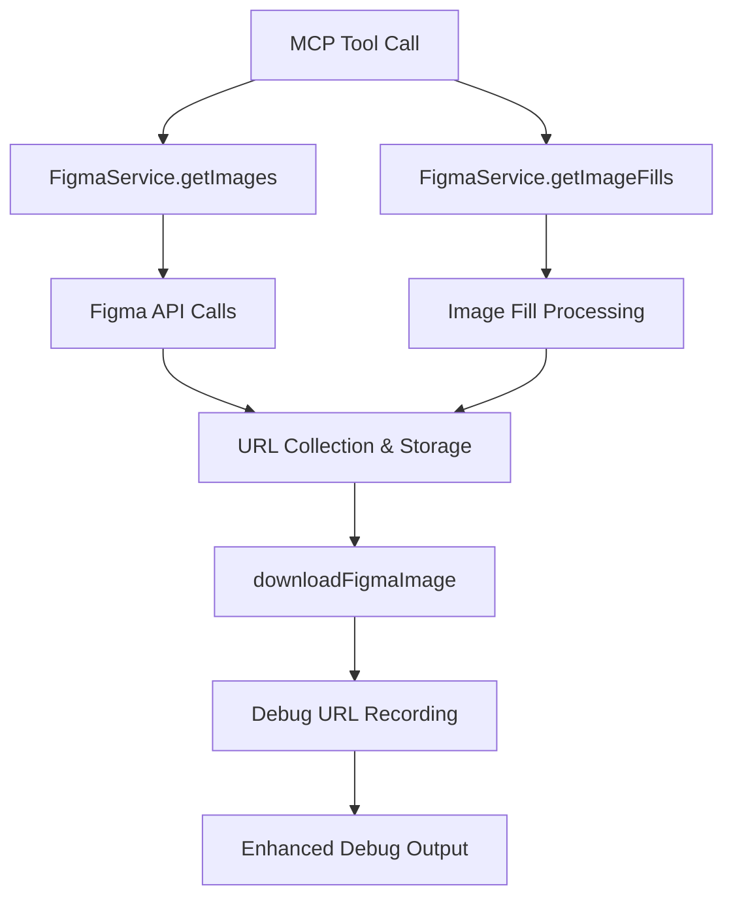

# Design Document

## Overview

This design enhances the existing image download debug system by adding URL tracking capabilities to the `ImageDownloadDebugCollector` class. The enhancement will capture and store actual download URLs during the image processing workflow, making them available in the debug output without disrupting the existing functionality.

The solution extends the current debug information structure to include URL tracking while maintaining backward compatibility with existing debug output formats.

## Architecture

### Current Architecture Analysis

The current image download system consists of:

1. **ImageDownloadDebugCollector**: Collects debug statistics and failure information
2. **FigmaService**: Handles API calls and coordinates downloads
3. **downloadFigmaImage**: Performs actual file downloads
4. **formatDebugInfoForUser**: Formats debug output for user consumption

### Enhanced Architecture

The enhancement adds URL tracking at key points in the download workflow:



## Components and Interfaces

### Enhanced ImageDownloadDebugInfo Interface

```typescript
export interface ImageDownloadDebugInfo {
  // Existing fields...
  totalNodesRequested: number;
  pngNodesCount: number;
  svgNodesCount: number;
  imageFillsCount: number;
  renderRequestsCount: number;
  apiResponseStatus: string;
  successfulDownloads: number;
  failedDownloads: Array<{
    nodeId: string;
    fileName: string;
    reason: string;
  }>;
  processingDetails: {
    validImageRefs: string[];
    invalidImageRefs: string[];
    excludedNodes: string[];
  };
  
  // New field for URL tracking
  downloadUrls: Array<{
    nodeId: string;
    fileName: string;
    format: 'PNG' | 'SVG' | 'IMAGE_FILL';
    url: string | null;
    status: 'success' | 'failed' | 'attempted';
  }>;
}
```

### Enhanced ImageDownloadDebugCollector Methods

New methods to be added:

```typescript
class ImageDownloadDebugCollector {
  // New methods
  addDownloadUrl(nodeId: string, fileName: string, format: 'PNG' | 'SVG' | 'IMAGE_FILL', url: string | null, status: 'success' | 'failed' | 'attempted'): void;
  getDownloadUrls(): Array<DownloadUrlInfo>;
  
  // Enhanced existing methods
  generateDebugSummary(): string; // Will include URL section
}
```

### URL Truncation Utility

```typescript
interface UrlDisplayOptions {
  maxLength: number;
  showDomain: boolean;
  truncateIndicator: string;
}

function truncateUrl(url: string, options: UrlDisplayOptions): string;
```

## Data Models

### DownloadUrlInfo Type

```typescript
type DownloadUrlInfo = {
  nodeId: string;
  fileName: string;
  format: 'PNG' | 'SVG' | 'IMAGE_FILL';
  url: string | null;
  status: 'success' | 'failed' | 'attempted';
};
```

### URL Display Format

URLs will be displayed in the debug output as:

```
Download URLs:
• PNG Images:
  - 2836-1478 (icon.png): https://figma-alpha-api.s3.us-west-2.amazonaws.com/... [truncated]
  - 1234-5678 (logo.png): No URL available
• SVG Images:
  - 9876-5432 (vector.svg): https://figma-alpha-api.s3.us-west-2.amazonaws.com/... [truncated]
• Image Fills:
  - 1111-2222 (background.png): https://figma-alpha-api.s3.us-west-2.amazonaws.com/... [truncated]
```

## Error Handling

### URL Capture Scenarios

1. **Successful URL Generation**: Store complete URL with 'success' status
2. **Failed URL Generation**: Store null URL with 'failed' status and reason
3. **API Response Missing URL**: Store null URL with 'attempted' status
4. **Network/Download Failure**: Keep URL but mark status as 'failed'

### Graceful Degradation

- If URL tracking fails, the system continues with existing debug functionality
- URL section is omitted from output if no URLs were captured
- Existing debug information remains unaffected by URL tracking failures

## Testing Strategy

### Unit Tests

1. **ImageDownloadDebugCollector URL Methods**
   - Test `addDownloadUrl` with various scenarios
   - Test URL retrieval and formatting
   - Test backward compatibility of existing methods

2. **URL Truncation Utility**
   - Test truncation with various URL lengths
   - Test edge cases (very short URLs, malformed URLs)
   - Test different truncation options

3. **Enhanced Debug Output Formatting**
   - Test `formatDebugInfoForUser` with URL data
   - Test output format consistency
   - Test backward compatibility

### Integration Tests

1. **End-to-End URL Tracking**
   - Test URL capture during actual download process
   - Test URL display in final debug output
   - Test with mixed success/failure scenarios

2. **API Integration**
   - Test URL capture from Figma API responses
   - Test handling of missing/empty URLs from API
   - Test with different image formats (PNG, SVG, fills)

### Backward Compatibility Tests

1. **Existing Functionality Preservation**
   - Verify all existing debug fields remain unchanged
   - Test existing tools/scripts continue to work
   - Verify performance impact is minimal

## Implementation Points

### URL Capture Integration Points

1. **In FigmaService.getImages()**: Capture URLs from API responses before download attempts
2. **In FigmaService.getImageFills()**: Capture URLs from image fill processing
3. **In downloadFigmaImage()**: Update status based on download success/failure

### Output Enhancement Points

1. **formatDebugInfoForUser()**: Add URL section to existing output
2. **generateDebugSummary()**: Include URL information in detailed summary
3. **MCP tool response**: Ensure URLs appear in user-facing debug information

### Performance Considerations

- URL storage adds minimal memory overhead
- URL truncation prevents excessive output length
- Lazy formatting of URLs only when debug output is requested